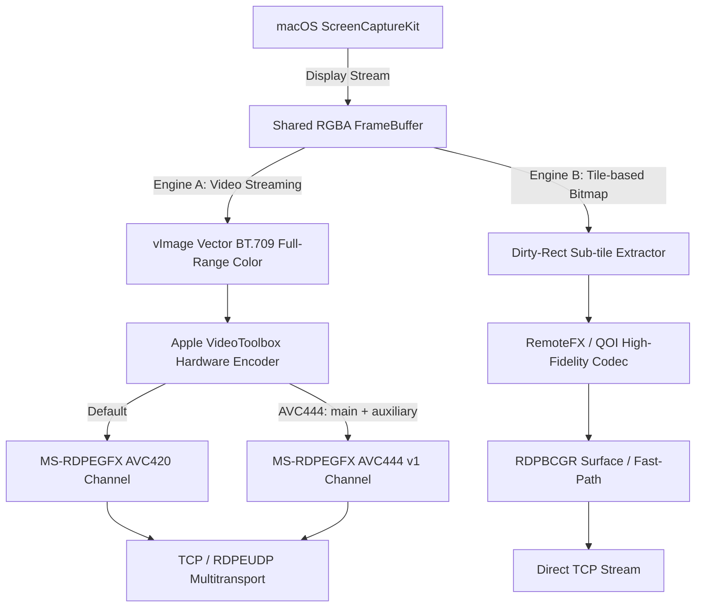
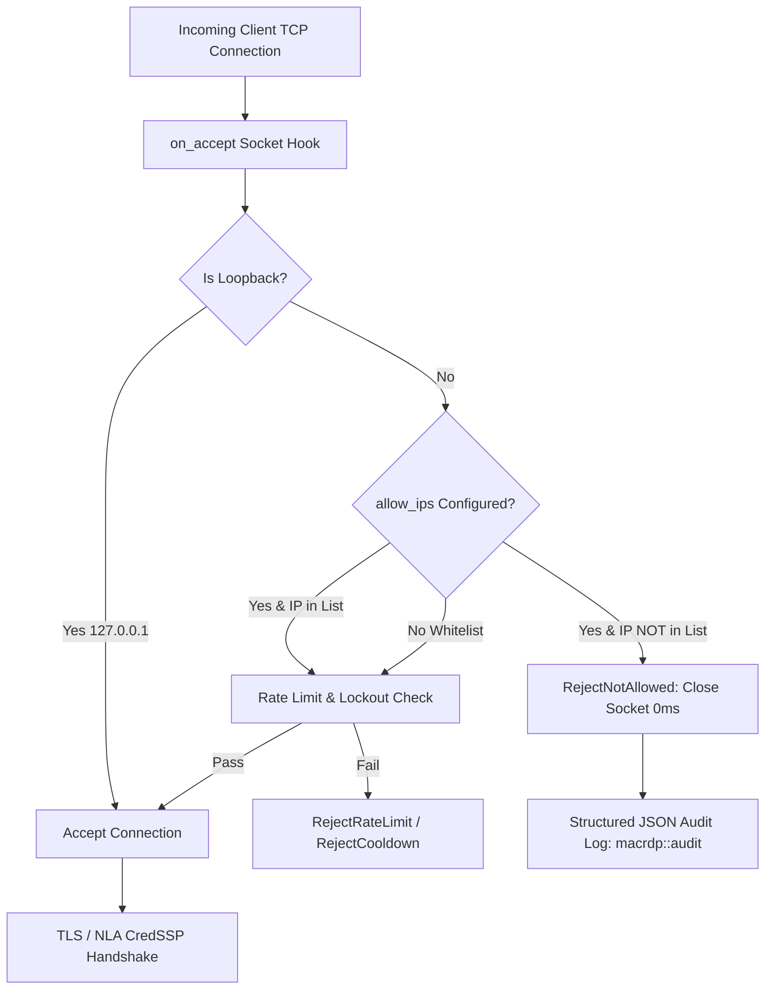

# macrdp: Deep Architecture, Pipeline Internals & Tuning Reference

This technical reference documents the complete internal architecture, dual-engine display pipelines, input/symbolic hotkey translation, authentication security guards, and empirical performance characteristics of `macrdp`. It serves as a comprehensive developer and AI agent reference.

---

## 1. Dual Display Pipeline Architecture

`macrdp` is built around two distinct, complementary display rendering engines. Understanding their trade-offs is fundamental to configuring optimal performance across varying network conditions and display resolutions.



### Engine A: Hardware-Accelerated Video Streaming (`--enable-h264`)
* **Core Technology:** Apple Silicon Media Engine via `VideoToolbox` framework + vector conversion via Apple's `Accelerate (vImage)` framework.
* **Pixel Pipeline:**
  1. `ScreenCaptureKit` delivers 32-bit BGRA frames.
  2. `vImage` converts BGRA to **BT.709 Full-Range NV12 (YUV 4:2:0)** in ~0.16–0.84 ms on NEON SIMD registers.
  3. `VTCompressionSession` encodes the NV12 frames into Annex-B H.264 NAL units in real-time hardware ASIC (<1 ms).
  4. NAL units are packetized into `MS-RDPEGFX` (`RDPGFX_WIRE_TO_SURFACE_PDU_1`).
* **Strengths:**
  * Highly fluid (60 FPS constant).
  * Minimal bandwidth (constant 10–15 Mbps even under high motion).
  * Ultra-low CPU utilization on host and client (<2% CPU; handled entirely by ASIC media decoders).
* **Limitations & Client Quirks:**
  * **mstsc 2-Frame Presentation Buffer:** Windows `mstsc.exe` holds a mandatory ~2-frame queue before presenting H.264 video. At 30 FPS, this induces ~66.7 ms latency; at 60 FPS, this drops to ~33.3 ms.
  * **Blank Recovery Loop:** On reconnect, `mstsc.exe` retains surface IDs across drops. If `macrdp` attempts aggressive auto-reconnect recovery, `mstsc` exhausts internal GDI/DirectX heaps and presents a misleading `"Because of a low memory condition..."` dialog. Setting `MACRDP_BLANK_RECOVERY=0` bypasses this loop.
  * **4K UHD Quantization:** Compressing 3840×2160 @ 60 FPS (0.5 gigapixels/sec) into 15–20 Mbps requires elevating the quantization parameter (QP), producing subtle macroblock softness during high-motion scenes.

---

### Engine B: Tile-Based Differential Bitmap Engine (Default / Native Path)
* **Core Technology:** `ScreenCaptureKit` dirty rect analysis + `RemoteFX` / `QOI` tile compression.
* **Client-negotiated codec:** This is the Windows-like RemoteFX/QOI tile path, not H.264. Windows `mstsc` normally negotiates RemoteFX; FreeRDP commonly selects QOIZ or QOI; some Windows App versions use NSCodec; clients with no mutually supported surface codec fall back to bitmap/RLE.
* **Pixel Pipeline:**
  1. `ScreenCaptureKit` yields dirty bounding boxes (modified screen regions).
  2. The server slices the dirty regions into 64×64 macro-tiles.
  3. Changed tiles are compressed independently via `QOI` or `RemoteFX` planar codec.
  4. Tiles are streamed as discrete RDP bitmap updates.
* **Strengths:**
  * **Zero Presentation Buffer (0-Frame Latency):** Client renders tiles immediately upon packet receipt with no decoding queue (<5–10 ms end-to-end latency).
  * **High text clarity:** QOI/QOIZ are lossless. For Microsoft clients, RemoteFX uses its maximum-quality quantizer (all bands at 6), while NSCodec uses CLL=1 with chroma subsampling disabled. These avoid H.264's 4:2:0 text-edge blur, though RemoteFX and NSCodec are not mathematically lossless.
  * **Bounded latency under load:** Native capture keeps only the newest pending ScreenCaptureKit sample, so a slow full-screen repaint drops intermediate motion rather than replaying stale frames.
  * **Zero Idle Bandwidth:** When the screen is static, the pipeline emits 0 packets and consumes 0% CPU/GPU.
  * **Single-Packet Updates:** Typing a character generates a ~1 KB tile that fits inside a single MTU packet (1500 bytes), arriving in sub-millisecond time.
* **Limitations:**
  * Full-screen scrolling triggers large bursts (30–50 Mbps momentarily), making it bandwidth-heavy for high-motion video.

---

## 2. Decision Matrix: Choosing the Right Launcher

| Metric / Scenario | 🎬 `start-ultimate.sh` (H.264 60FPS) | 🏛️ `start-native.sh` (HiDPI bitmap 12FPS) |
| :--- | :--- | :--- |
| **Optimal Resolution** | 1080p (FHD) / 1440p (2K) | 4K UHD (3840×2160) / 2K / 1080p |
| **Primary Workload** | Browsing, video, dynamic UI, 60Hz fluid motion | Coding, document writing, static text, terminal |
| **Text Sharpness** | High (compressed YUV 4:2:0) | **Highest bitmap-codec fidelity; QOI/QOIZ lossless** |
| **Typing / Mouse Latency** | ~33 ms (bounded by mstsc 2-frame buffer) | **<5–10 ms (Instantaneous 0-frame presentation)** |
| **Idle Resource Usage** | Constant ~12 Mbps stream | **0 Mbps / 0% CPU (True zero-idle)** |
| **Motion Bandwidth** | Strictly capped (12–15 Mbps) | Spikes to 30–50 Mbps on full-screen scroll |

---

## 3. AuthGuard & IP Whitelisting (`--allow-ip`)

`macrdp` incorporates an auth-hardening subsystem (`src/auth_guard.rs`) operating at the single-process TCP accept stage.



### Key Technical Properties:
* **$O(1)$ Hash Lookup:** Whitelist checks use `HashSet::contains(&canonical_ip)` taking ~5–10 ns per connection.
* **Zero Runtime Overhead:** The check executes once during TCP accept; zero CPU cycles are spent during active frame streaming.
* **Pre-TLS Drop:** Unauthorized IPs are terminated before allocating TLS state, SPKI keys, or PAM processes.
* **Audit Logging:** Every rejection is recorded with structured telemetry:
  ```json
  {"schema_version":1,"macrdp_version":"0.9.6","host":"my-mac.local","event":"reject","reason":"ip_not_allowed","src_ip":"192.168.1.20"}
  ```

---

## 4. Input & Symbolic Hotkey Subsystem

macOS `WindowServer` prohibits synthetic user-space CGEvents (`CGEventPost`) from firing native symbolic hotkeys (e.g. `Cmd+Tab`, `Ctrl+Left/Right` Spaces, Spotlight). `macrdp` implements custom user-space intercepts in `src/input.rs`:

1. **`Cmd+Tab` & `Alt+Tab` (`--alt-tab-switch`):**
   * Uses macOS Accessibility APIs (`AXUIElement`) to maintain an MRU process list.
   * On release, targets the selected application via `AXRaise`, un-minimizes window state (`--unminimize-on-switch`), and transitions to the app's full-screen Space.
2. **Mission Control, Spaces & Text Navigation:**
   * macOS reserves plain `Ctrl+Arrow`, but WindowServer rejects these symbolic shortcuts when they arrive through user-space `CGEventPost`. macrdp therefore intercepts only the exact plain chords and asks System Events to drive the user's enabled native shortcuts: `Ctrl+Up` opens Mission Control, `Ctrl+Down` opens Application Windows, and `Ctrl+Left/Right` moves to the previous/next Space. Key-repeat is swallowed after the first press so the toggle actions cannot flicker open/closed. A first Up/Down implementation directly executed Apple's Mission Control helper, but macOS 26 killed that child with SIGKILL. The unified System Events path is live-verified for all four directions on the target mstsc client.
   * `Alt + Arrow` maps to macOS `Option + Arrow` (word-by-word jump).
   * `Win + Arrow` maps to macOS `Cmd + Arrow` (line beginning / line end).
3. **Emergency Resync Hotkey (`Ctrl + Alt + Shift + R`):**
   * Forces an immediate display stream re-mode and AudioToolbox format re-negotiation without tearing down the TCP socket.
4. **Window Gathering Hotkey (`Ctrl + Alt + G`):**
   * Sweeps all off-screen and detached windows onto the primary display coordinate space.

---

## 5. Summary of Launch Scripts

| Script | Engine | Flags & Purpose |
| :--- | :--- | :--- |
| **`start-ultimate.sh`** | H.264 (60 FPS) | `--fps 60 --bitrate 25 --adaptive-bitrate --enable-udp-multitransport --enable-aac --h264-frames-in-flight 1 --flush-frames 2` |
| **`start-avc444.sh`** | HiDPI AVC444 (10 FPS) | Stability-first 4:4:4 H.264 with synchronized all-IDR main/auxiliary pairs; RDP 10+ with automatic AVC420 fallback |
| **`start-native.sh`** | HiDPI bitmap (12 FPS) | `--hidpi --fps 12` plus maximum-fidelity RemoteFX/NSCodec tuning; newest-frame-only capture queue |
| **`start.sh`** | Dispatcher | Starts Ultimate by default; accepts `avc444`, `native`, or `fast` as named alternatives |
